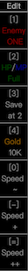
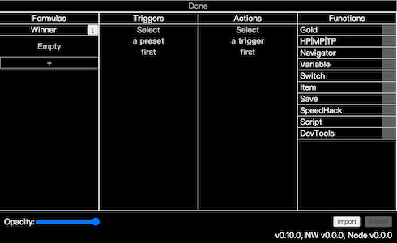
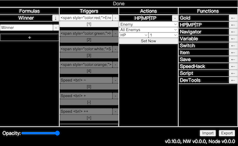

# Cheat Menu for RPG Maker MV/MZ

inspired by (forked
from) [emerladCoder/RPG-Maker-MV-Cheat-Menu-Plugin](https://github.com/emerladCoder/RPG-Maker-MV-Cheat-Menu-Plugin)

---

### ⚠️⚠️⚠️ Still in TESTING, Save Game Frequently ⚠️⚠️⚠️

- Tested in
  - NW v0.29.0
  - NW v0.49.0

---

### Previews

  
<br>



### Installation

- Download [Cheat Menu](https://github.com/allape/RPG-Maker-MV-Cheat-Menu-Plugin/releases).
- Extract the zip file and copy everything to game folder.
  - Make sure that `patch.bat` is in the same folder of `Game.exe`.
- Double click `patch.bat`.

### Uninstallation, for now.

- Open `www/js/plugins.js` or `js/plugins.js`, scroll to the end of the file,
  delete the line that contains `AsCheater` and save the file.

### FAQ

- There is no `www/js/plugins` or `js/plugins` in game folder.
  - Use [EnigmaVBUnpacker](https://f95zone.to/threads/rpg-maker-mv-unpacker.417/post-3577739) to unpack game.

### Dev

```shell
# run
npm run dev
# build
npm build
```
