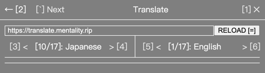

## Cheat Menu for RPG Maker MV/MZ, inspired by (forked from) [emerladCoder/RPG-Maker-MV-Cheat-Menu-Plugin](https://github.com/emerladCoder/RPG-Maker-MV-Cheat-Menu-Plugin)

---
### ⚠️⚠️⚠️ Still in TESTING, Save Game Frequently ⚠️⚠️⚠️
---

### In Progress
- `Searching Text Field` caches with game saving file
- `Scroll Selector` states cache with game saving file

### Screenshots



### Features
- Keyboard and Mouse both supported 
- Modules
  - God Mode: `whoisyourdaddy`
  - Speed: Move speed cheat, not game running speed; [Cheat Engine](https://www.cheatengine.org/) supports speed hack
  - Gold
  - Items
  - Weapons
  - Armors
  - Variables
  - No Clip
  - Enemy HP: manipulate HP of enemies in battle
  - Party MP: manipulate MP of teammates and hero itself in battle
  - Party TP: manipulate TP of teammates and hero itself in battle
  - Party HP: manipulate HP of teammates and hero itself in battle
  - Status: manipulate Max HP, max MP, attack, defense and more
  - Give Experience
  - Switches: Toggle boolean variables
  - Teleport
  - Translate
    - Open source online translation services: [LibreTranslate](https://github.com/LibreTranslate/LibreTranslate#mirrors)
    - Draw japanese to translate: [Google Translate](https://translate.google.com/?sl=ja&tl=en&op=translate), [jisho](https://jisho.org/#handwriting)
    - ✔ Message window translate
    - ✔ Choices translate
    - ❌ Menu or Item translate
    - ❌ Image text translate

### Installation
- Download release zip
- Way 1, traditional
  - Download Cheat Plugin patch at [GitHub](https://github.com/emerladCoder/RPG-Maker-MV-Cheat-Menu-Plugin)
  - Unzip these zips
  - Copy everything in release zip into `Cheat_Menu/`
  - Copy all files inside `Cheat_Menu/` into game folder
  - Run `MVPluginPatcher.exe`
- Way 2, with JavaScript interpreter
  - Unzip release zip
  - Copy all files into game folder
  - Run `patcher.exe`
- Start game, then load a game or start a new game, then press `1` to display cheat menu 

### FAQ
- After double-clicking `MVPluginPatcher.exe`, there is a black window keeps showing
  - It means this exe failed to patch the game with cheats
- There is no `www/js/plugins` or `js/plugins` in game folder
    - use [EnigmaVBUnpacker](https://f95zone.to/threads/rpg-maker-mv-unpacker.417/post-3577739) to unpack game

### Dev

#### nodejs
```shell
# install dependencies
npm i
# build production, this will also build patcher. (Windows requires `MINGW64` to run shell script)
npm run-script build
```
#### go
```shell
cd patcher
# install go mod dependencies
go get
# build executable patcher
./build.sh
```

#### Styles inspection, and styles only, [index.html](public/index.html)

#### Copy files after built, details in [postbuild.js](postbuild.js)
- create a file, `copycat.json`, at project root dir
- key is a relative path to project root dir, value is an absolute path which is destination
