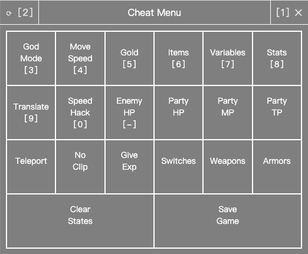

## Cheat Menu for RPG Maker MV/MZ, inspired by (forked from) [emerladCoder/RPG-Maker-MV-Cheat-Menu-Plugin](https://github.com/emerladCoder/RPG-Maker-MV-Cheat-Menu-Plugin)

---
### ⚠️⚠️⚠️ Still in TESTING, Save Game Frequently ⚠️⚠️⚠️
---

### Executable `patcher` is not supported in macOS yet

### Screenshots
  
  
  

### Features
- Keyboard and Mouse both supported
  - All shortcuts are displayed inside `[]`
    - For example, `[1]` means to hit `number 1` (not the `1` on number pad) to display
  - `Copy`, `Text Selection`, `Search`, etc all require mouse to operate
- Hovering icon button to display description if description is available
- Modules
  - God Mode
  - Move Speed
  - Gold
  - Items
  - Variables
  - Status: manipulate Max HP, max MP, attack, defense and more
  - Translate
    - Open source online translation services: [LibreTranslate](https://github.com/LibreTranslate/LibreTranslate#mirrors)
    - Draw japanese to translate: [Google Translate](https://translate.google.com/?sl=ja&tl=en&op=translate), [jisho](https://jisho.org/#handwriting)
    - ✔ Message window translate
    - ✔ Choices translate
    - ❌ Menu or Item translate
    - ❌ Image text translate
  - Speed Hack: [Cheat Engine](https://www.cheatengine.org/) also supports speed hack, but CE may cause program freeze (nwjs base game, but Unity3D is completely fine)
  - Enemy HP: manipulate HP of enemies in battle
  - Party HP: manipulate HP of teammates and hero itself in battle
  - Party MP: manipulate MP of teammates and hero itself in battle
  - Party TP: manipulate TP of teammates and hero itself in battle
  - Teleport
  - No Clip
  - Give Experience
  - Switches: Toggle boolean variables
  - Weapons
  - Armors
  - Clear States
  - Game Save: for emergency only

### Installation
- Download [release zip](https://github.com/allape/RPG-Maker-MV-Cheat-Menu-Plugin/releases)
- Traditional method
  - Download Cheat Plugin patch at [GitHub](https://github.com/emerladCoder/RPG-Maker-MV-Cheat-Menu-Plugin)
  - Unzip these zips
  - Copy everything inside release zip into `Cheat_Menu/`, and allow overriding existing files
  - Copy all files inside `Cheat_Menu/` into game folder
  - Run `MVPluginPatcher.exe`
- New method with JavaScript interpreter
  - Unzip release zip
  - Copy all files into game folder
  - Run `patcher.exe`
- Start Game, wait for 1 second at least, then load an existing save or start a new game 
  - Press `1` to open/hide cheat menu
  - Click top-left corner to open cheat menu

### Uninstallation, for now. `patcher` will support uninstallation in the future
- Open `www/js/plugins/AsCheater.js` or `js/plugins/AsCheater.js` with text editor, remove every character, then save.
- Re-installation requires the full steps in `Installation` without patching

### FAQ
- After double-clicking `MVPluginPatcher.exe`, there is a black window keeps showing
  - It means this exe failed to patch the game with cheats
- There is no `www/js/plugins` or `js/plugins` in game folder
    - Use [EnigmaVBUnpacker](https://f95zone.to/threads/rpg-maker-mv-unpacker.417/post-3577739) to unpack game
- If `Cheat Menu` is not working, or game prompt an ERROR on starting
  - Restore `www/js/plugins.js` or `js/plugins.js` with `plugins.js.bak` using a text editor. Or reinstall the game
  - Replace the content in `plugins_patch.go.txt` to `AsCheater_legacy`
    - Or delete `plugins_patch.go.txt`, then rename `plugins_patch.legacy.go.txt` to `plugins_patch.go.txt`
  - Follow the `Installation` to patch plugin

### Dev

#### `tsc`-ing before `webpack` is for type check

#### Building on Windows requires changing `./build.sh` to `build.sh` in `build:go` of `package.json` scripts

#### nodejs
```shell
# install dependencies
npm i
# build production, this will also build patcher. (Windows requires `MINGW64` to run shell script)
npm run-script build
```
#### go
```shell
cd patcher
# install go mod dependencies
go get
# build executable patcher
./build.sh
```

#### Styles inspection, and styles only, [index.html](public/index.html)

#### Copy files after built, details in [postbuild.js](postbuild.js)
- Create a file, `copycat.json`, at project root dir
- Key is a relative path to project root dir, value is an absolute path which is destination
